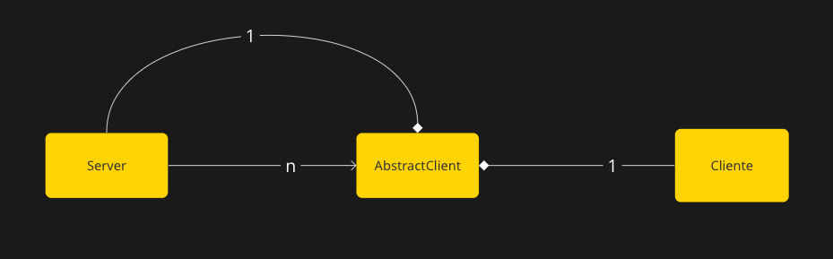

##Ejercicio 8

Antes de realizar el ejercicio, realizo un analisis de los pasos a seguir.

Para poder conseguir paralelismo en el servidor tendre que utilizar la libreria `multiprocessing`, para poder evitar el GIL, utilizando subprocesos en vez de threads.

Por cada subproceso creado, el servidor debera tener un subproceso por cliente, llamado Abstract client, luego, el servidor solo se comunicara con sus abstracciones de un cliente, las cuales se ejecutan en paralelo.

Con esta imagen se pueden apreciar las dependencias: 
+ Un Abstractclient esta compuesto por un cliente y un server ya que  no puede existir sin ellos.
+ Un server tiene N Abstractclients, dependiendo de las conexiones con clientes que necesite.

Para esto cuento la desventaja de necesitar un refactor el cual separe la logica de comunicacion de la de negocio, ya que estan muy solapadas y el codigo se volvio muy intrincado.

Una vez separe ambas partes, la comunicacion entre procesos estara dada a traves de pipes que provee la libreria `multiprocessing`, cada Abstractclient tendra un pipe de comunicacion con el servidor y el socket proveido por el servidor al momento de su creacion para poder comunicarse con el cliente.

La logica de eleccion de ganador permanecera en el server, y una vez se cumplan las condiciones, este le informara a cada Abstractclient los ganadores, y este, a su vez, se los comunicara a su cluente asociado.

